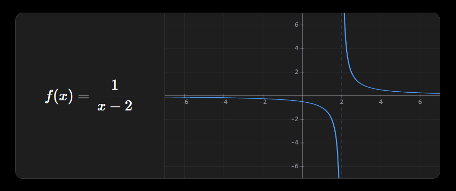
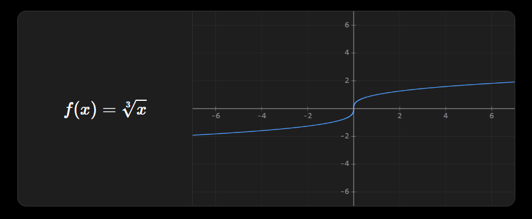
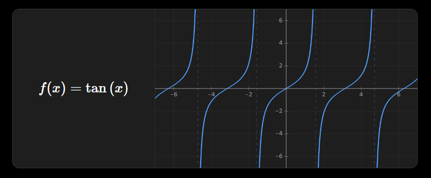

# obsi-math

[Obsidian](https://obsidian.md) plugin for plotting mathematical functions directly in your notes, using `obs-graph` code blocks. It renders the expression in LaTeX, draws the graph with a WebGL + Canvas 2D engine (Desmos-style), and automatically calculates roots, vertices, and intercepts.



---

## Features

- 📈 Real-time plotting with a WebGL engine (curves) + Canvas 2D overlay (axes, grid, labels).
- ✏️ LaTeX rendering of the input expression, including nested exponents and roots of any index.
- 🔍 Interactive zoom and pan with the mouse, with precise cursor position detection.
- 📍 Automatic detection of roots, vertices (maxima/minima), and Y-intercept.
- ⚡ Vertical asymptotes detected and drawn as dashed lines, with correct behavior when zooming out.
- 🎨 Desmos-style aesthetic: subtle grid, discrete axes, correct margins and centering, no distortion when resizing.
- 🔤 Input support for LaTeX, Unicode (`π`, `√`, `×`, `÷`, `²`, `³`), and standard math notation.

---

## Installation

### Manual

1. Download `main.js` and `manifest.json` from the latest release.
2. Create an `obsi-math` folder inside `<your-vault>/.obsidian/plugins/`.
3. Copy the files there.
4. In Obsidian: **Settings → Community plugins** → enable **Obsi Math**.

### From source

````bash
git clone https://github.com/RughustDev/obsi-math.git
cd obsi-math
npm install
npm run build
````

Copy the generated `main.js` (along with `manifest.json`) into your vault's plugins folder.

---

## Usage

Create a code block with the `obs-graph` language and write your function:

````markdown
```obs-graph
x^2 - 4
```
````

You can also write the full equation; the plugin automatically takes the right-hand side:

````markdown
```obs-graph
f(x) = sin(x) * 2
```
````

The block renders the expression in LaTeX, the interactive graph, and calculated data: Y-intercept, real roots, and vertices.

**More examples:**

````markdown
```obs-graph
1/(x-2)
```
````

````markdown
```obs-graph
sqrt(x) + 1
```
````

````markdown
```obs-graph
\sqrt[3]{x}
```
````

````markdown
```obs-graph
x^{3^{2}}
```
````

### Graph interaction

| Action | Effect |
|---|---|
| Drag | Pans the view |
| Mouse wheel | Zoom in/out centered on the cursor |

---

## Input syntax

The plugin normalizes different input formats before evaluating them with [mathjs](https://mathjs.org/):

| Type | Examples |
|---|---|
| Unicode | `π`, `√`, `×`, `÷`, `²`, `³`, `∞` |
| LaTeX | `\frac{1}{2}`, `x^{2}`, `\sqrt{x}`, `\sqrt[3]{x}`, `\sin{x}`, `\log_{2}{x}` |
| Standard | `sin(x)`, `cos(x)`, `log(x, 2)`, `sqrt(x)` |

**Trigonometry:** a literal numeric argument (e.g. `sin(30)`) is interpreted in **degrees**. If it contains a variable (e.g. `sin(x)`), it's evaluated in radians.

**Roots of any index:** the `\sqrt[n]{x}` notation is supported for cube roots, fourth roots, fifth roots, etc. Odd-index roots of negative numbers return the real value (e.g. `\sqrt[3]{-8} = -2`).



**Complex numbers:** not supported. If the function produces an imaginary result (e.g. `sqrt(-1)`), the graph will appear empty.

---

## Known issues

- ~~**Broken LaTeX rendering of `\sqrt`, `\log`, etc. without braces**~~ — fixed. The renderer now correctly handles commands like `\sqrt{x}` without producing broken output like `\sqrtx`.
- ~~**Extra parentheses in nested exponents**~~ — fixed. Expressions like `x^{3^{2}}` now render and evaluate correctly, with no redundant parentheses in the LaTeX output.
- ~~**Cursor position offset during zoom**~~ — fixed. The zoom now centers exactly on the cursor's actual position on screen.
- ~~**Ghost asymptote in functions like `x^{2^{π}}`**~~ — fixed. When panning the X axis out of the viewport, the pole detector incorrectly interpreted the crossing as a discontinuity and drew a phantom line over the Y axis. No longer occurs.
- The visual behavior of functions with dense asymptotes (e.g. `sec(10x)`) at extreme zoom out is inherent to the periodic nature of those functions; it has been significantly improved but does not disappear entirely.



---

## obs-system (temporarily disabled)

The plugin includes an `obs-system` block for solving and graphing linear equation systems, but it's **currently disabled**: using it only shows a notice.

Reason: it's still a very basic feature, with noticeable lag during zoom and pan (dragging the view). Development is currently focused on polishing `obs-graph`, so `obs-system` will be revisited and improved later on.

To re-enable it during development, in `main.ts`:

````typescript
private readonly OBS_SISTEMA_HABILITADO = false; // → true
````

---

## Development

Requirements: Node.js, npm, TypeScript.

````bash
npm run build
````

Recommended workflow: edit `main.ts` → compile → copy `main.js` to a test vault → verify → back up if it works, restore if it breaks.

> **Important:** both `manifest.json` and `main.ts` must be saved as **UTF-8 without BOM**. A BOM at the start of either file can break parsing in Obsidian or cause silent compilation errors.

---

## Roadmap

- [ ] Re-enable and polish `obs-system` (zoom/pan performance).
- [ ] Info panel integrated directly into the graph.
- [ ] Global settings (decimal precision, theme).
- [ ] Trig unit selector (degrees/radians/gradians).
- [ ] Full rich LaTeX input support.

---

## License

MIT — see [LICENSE](./LICENSE).

## Repository

[github.com/RughustDev/obsi-math](https://github.com/RughustDev/obsi-math)