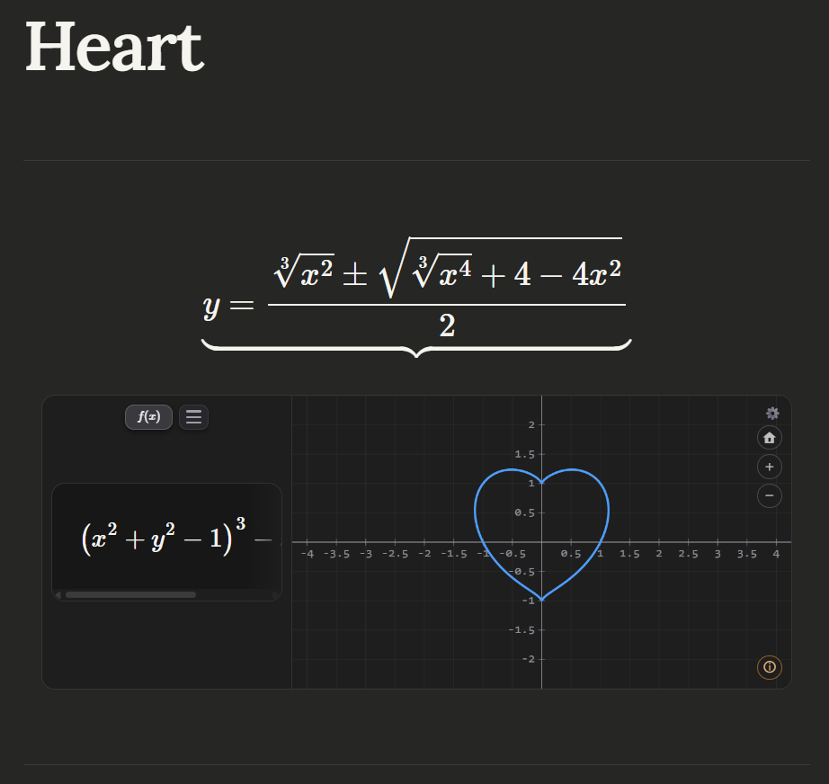
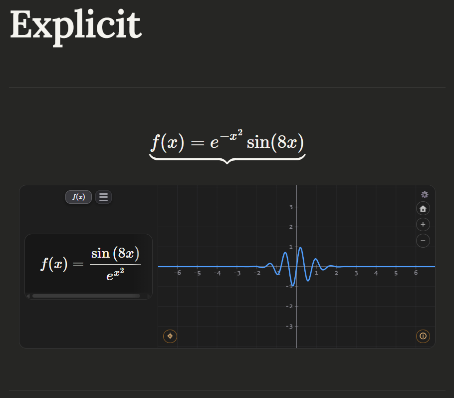
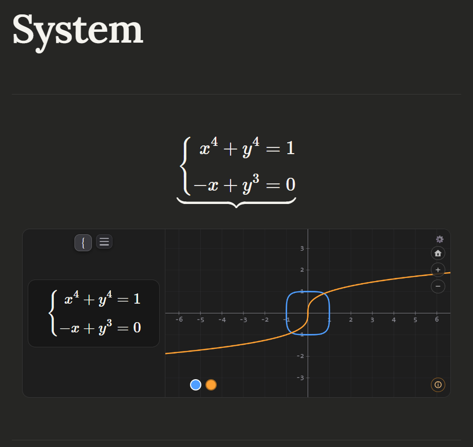
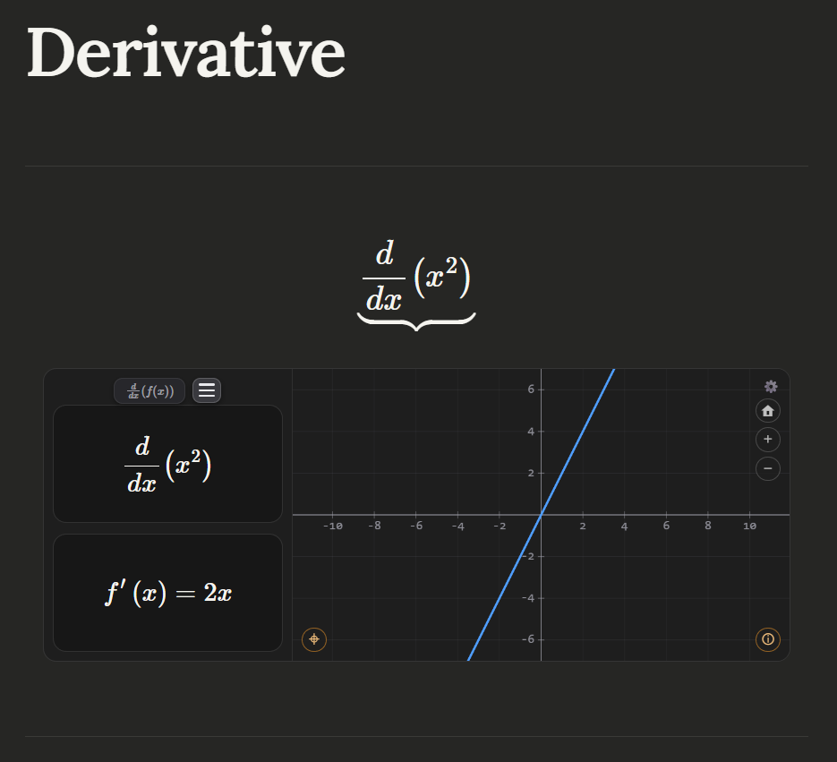
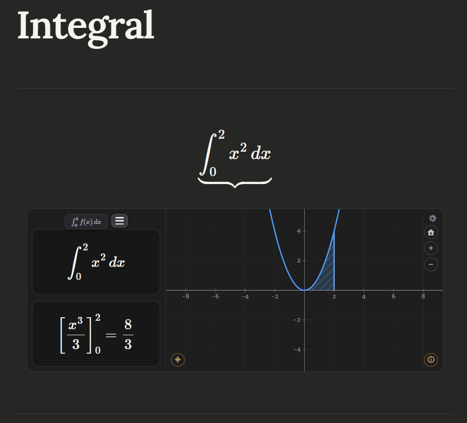
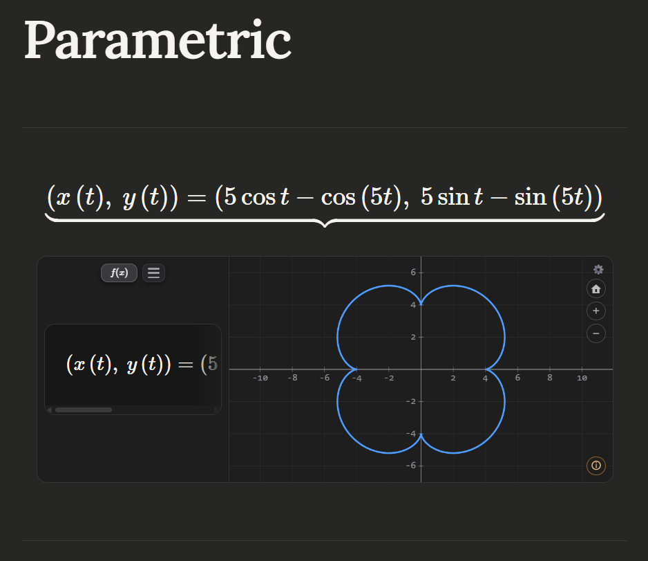
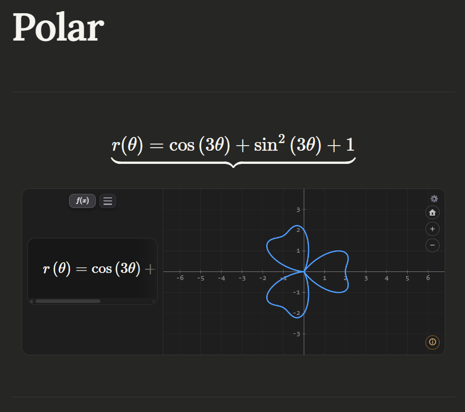

# LMath

LMath is an [Obsidian](https://obsidian.md) plugin for graphing functions, systems of equations, derivatives and integrals directly inside your notes: each block shows the formula rendered in LaTeX (KaTeX) on the left, and an interactive Cartesian plane (pan, zoom, crosshair, rail mode) on the right.

---

## Contents

- [Available blocks](#available-blocks)
- [Features](#features)
- [Cover](#cover)
- [Gallery](#gallery)
- [Installation](#installation)
- [Usage](#usage)
- [Input syntax](#input-syntax)
- [Settings](#settings)
- [Known limitations](#known-limitations)
- [Contributing](#contributing)
- [License](#license)

---

## Available blocks

| Block | What it graphs |
|---|---|
| ` ```obs-graph ` | A single function or curve: explicit `y=f(x)`, implicit `F(x,y)=0`, parametric `(x(t), y(t))` or polar `r(θ)`. |
| ` ```obs-system ` | Several equations (one per line, or LaTeX `\begin{cases}…\end{cases}`), each with its own color, plus the **solutions of the system** (intersections between curves). |
| ` ```obs-derivate ` | Differentiates `f(x)` symbolically and graphs **only the derivative** `f'(x)`. |
| ` ```obs-integral ` | Definite integral `\int_a^b f\,dx`: graphs the integrand, **shades the region** between `a` and `b` and shows the signed area (and the antiderivative, when the built-in integrator covers it). |

## Features

- Custom graphing engine: it discovers and traces the curve by arc length (it does not sample over a pixel-bound grid), so bounded curves (heart, astroid, lemniscate) neither deform nor vanish when you zoom out.
- Dense implicit curves now switch to viewport-aware pixel rasterization with marching squares when needed, so highly oscillatory families render as filled bands instead of sparse hatch marks.
- LaTeX rendering of the entered expression, including nested exponents, roots of any index, and parametric/polar curves with their own notation.
- Interactive zoom and pan with the mouse and the keyboard.
- Interactive crosshair: it follows the cursor and shows `x` and `f(x)` in real time, with a marker on the curve.
- Rail mode (⌖): walk along the curve with the keyboard by on-screen arc length; at vertical asymptotes it jumps to the neighboring branch instead of derailing.
- The rendering plane adapts to the curve: smooth implicit curves use continuation tracing, while extremely dense implicit fields can render via pixel-level marching squares for a more faithful visual result.
- Automatic detection of roots, vertices and the Y intercept, displayed as markers on the plane; functions with infinitely many notable points (periodic ones) show a summary through the ⓘ button.
- Vertical asymptotes detected and drawn as dotted lines.
- Classification of non-graphable blocks (*Not defined over ℝ*, *Undefined*, *Indeterminate*, *Unsupported symbol*, etc.) with an informative overlay on the plane; the LaTeX panel never shows a verdict, only the formula.
- Input in LaTeX, Unicode (`π`, `√`, `×`, `÷`, `²`, `³`, `θ`, `∞`) and standard mathematical notation.
- Support for absolute value (`|x|`, `\left|…\right|`, `abs(x)`), the six inverse trigonometric functions and step functions (`⌊x⌋`, `⌈x⌉`).
- Automatic simplification of every displayed expression, and solving for `y` either manually or optionally automatically (see [Settings](#settings)).

---

## Cover

<figure>
	
	<figcaption><strong>Cover.</strong> Heart-shaped implicit curve traced on a Cartesian plane, with the formula rendered in the side panel.</figcaption>
</figure>

---

## Gallery

### Basic graphing

<figure>
	
	<figcaption><strong>Explicit function.</strong> Explicit function rendered in the panel and traced on the plane with axes and interactive markers.</figcaption>
</figure>

### Systems

<figure>
	
	<figcaption><strong>Systems of equations.</strong> System of equations traced with differently colored curves and highlighted intersections on the plane.</figcaption>
</figure>

### Derivatives

<figure>
	
	<figcaption><strong>Derivatives.</strong> Symbolic derivative shown in a split view, with the operator and the result displayed separately.</figcaption>
</figure>

### Integrals

<figure>
	
	<figcaption><strong>Definite integrals.</strong> Definite integral with a shaded region, evaluated antiderivative and the area reading in the panel.</figcaption>
</figure>

### Special curves

<figure>
	
	<figcaption><strong>Parametric curves.</strong> Parametric curve traced from its components, with the corresponding notation in the panel.</figcaption>
</figure>

<figure>
	
	<figcaption><strong>Polar curves.</strong> Polar curve traced with the <code>r(θ)</code> notation in the panel and its corresponding geometry on the plane.</figcaption>
</figure>

---

## Installation

### From Obsidian (recommended)

1. Open **Settings → Community plugins** and turn off **Restricted mode** if it is on.
2. Click **Browse**, search for **LMath**, and click **Install**.
3. Click **Enable**.

### Manual

1. Download `main.js`, `manifest.json` and `styles.css` from the latest release.
2. Create the `lmath` folder inside `<your-vault>/.obsidian/plugins/`.
3. Copy the files there.
4. In Obsidian: **Settings → Community plugins** → enable **LMath**.

### From source

```bash
git clone https://github.com/LubrieDev/lmath.git
cd lmath
npm install
npm run build
```

Copy the generated `main.js` (along with `manifest.json` and `styles.css`) to your vault's plugins folder.

---

## Usage

### obs-graph

Write a function; if you write a full equality the plugin automatically takes the right-hand side (`y = …`, or a single-letter function label such as `f(x) = …`).

````markdown
```obs-graph
f(x) = sin(x) * 2
```
````

Implicit, parametric and polar:

````markdown
```obs-graph
x^3 + y^3 = 9
```
````

````markdown
```obs-graph
x(t) = 5*cos(t) - cos(5*t)
y(t) = 5*sin(t) - sin(5*t)
```
````

````markdown
```obs-graph
r = sin(3*theta)
```
````

### obs-system

One equation per line; each one takes its own color, and the solutions (intersections) between them are marked.

````markdown
```obs-system
y = x + 1
y = -x^2 + 3
```
````

### obs-derivate

You only write `f(x)`; the block differentiates and graphs `f'(x)`.

````markdown
```obs-derivate
x^3 - 2*x
```
````

### obs-integral

LaTeX input with the limits of integration.

````markdown
```obs-integral
\int_{0}^{2} x^2 \, dx
```
````

### More input examples (obs-graph, obs-derivate, obs-integral)

Vertical asymptote:

````markdown
```obs-graph
1/(x-2)
```
````

Absolute value:

````markdown
```obs-graph
|x^2 - 4|
```
````

Inverse trigonometric function:

````markdown
```obs-graph
arctan(x)
```
````

Root of an arbitrary index:

````markdown
```obs-graph
\sqrt[3]{x}
```
````

Nested exponent (rendered and evaluated as `x⁹`):

````markdown
```obs-graph
x^{3^{2}}
```
````

### Interacting with the graph

| Action | Effect |
|---|---|
| Move the cursor | Shows a crosshair with `x` and `f(x)` in real time |
| Bring the cursor near a notable point | Shows a coordinate label `(x, y)` |
| Drag | Moves the view (pan) |
| Mouse wheel | Zoom in/out centered on the cursor |
| ⌖ button (rail mode, when the curve is walkable) | Walk along the curve with the keyboard, jumping between branches at asymptotes |
| In `obs-system`, the color button per equation | Choose which curve the crosshair/rail follows |

### Functions with many notable points

In periodic functions such as `sin(x)` or `tan(x)`, the roots and vertices are infinite and are not drawn individually. Instead, an **ⓘ** button appears in the corner of the graph and shows a summary when clicked.

### Non-graphable functions

If the function does not produce any real value (for example `sqrt(-1)` or `log(x)/log(1)`), the plane is dimmed with a label indicating the cause: *Not defined over ℝ*, *Undefined*, *Indeterminate*, among others. Zoom and pan remain active.

An empty block shows the message *No function* instead of an error.

---

## Input syntax

The plugin normalizes different formats before evaluating them with [mathjs](https://mathjs.org/). This applies to all four blocks, which share the same parser.

| Type | Examples |
|---|---|
| Unicode | `π`, `√`, `∛`, `∜`, `×`, `÷`, `²`, `³`, `θ`, `∞`, `⌊x⌋`, `⌈x⌉` |
| LaTeX | `\frac{1}{2}`, `x^{2}`, `\sqrt{x}`, `\sqrt[3]{x}`, `\sin{x}`, `\log_{2}{x}`, `\left|x\right|`, `\int_a^b f\,dx` |
| Standard | `sin(x)`, `cos(x)`, `log(x, 2)`, `sqrt(x)`, `abs(x)` |
| Inverse | `arcsin(x)`, `sin⁻¹(x)`, `asin(x)` (and their analogues for cos, tan, csc, sec, cot) |

> ⚠️ **Trigonometry (degrees vs. radians):** if the argument is a literal number (e.g. `sin(30)`), it is interpreted in **degrees**; if the argument contains a variable (e.g. `sin(x)`), it is evaluated in **radians**.

**Roots of any index:** the `\sqrt[n]{x}` notation is supported for cube, fourth, fifth roots, and so on. Odd-index roots with a negative radicand return the real value (e.g. `\sqrt[3]{-8} = -2`).

**Absolute value:** `|x|`, `\left|x\right|` and `abs(x)` are all accepted.

**Inverse trigonometric functions:** `arccsc`, `arcsec` and `arccot` are not native to mathjs; the plugin implements them as real-domain wrappers.

**Component-wise parametric curves:** `x(t)=…` and `y(t)=…` on separate lines are merged into a single curve; a lone component also graphs, respecting the axis it declares (`y(t)=…` gives the classic graph, `x(t)=…` comes out lying on its side).

**Unrecognized symbol:** an unknown LaTeX command (`\alpha`, `\sum`, …) does not silently degrade into a free variable: the block shows **"Unsupported symbol"**.

**Complex numbers:** not supported. If the function produces an imaginary result, the plane will show the non-graphable function overlay.

---

## Settings

The plugin adds a settings tab (**Settings → LMath**):

- **Language** — language selector for the interface text (English / Spanish; English by default).
- **Solve automatically** — when rendering, it directly shows the solved result (`y = f(x)`) without pressing the "Solve" button.
- **Show notable points** — draws the markers for roots, vertices, Y intercepts and system solutions on the plane. Turning it off leaves the plane clean; the ⓘ summary still lists them, and the crosshair and rail mode are unaffected.
- **Automatic framing** — zooms the initial view in when the curve is bounded and leaves a lot of empty plane (heart, lemniscate, astroid…); it only zooms in, never out.

---

## Known limitations

> This version is already at a mature stage, but it may still contain bugs. If you find one, report it in an issue with the exact block that reproduces it.

- `obs-system` requires two or more equations; for a standalone curve (including an implicit one), use `obs-graph`.
- Regions and inequalities are not graphed: the LaTeX inequality operators (`\ge`, `\le`, `\geq`, `\leq`) are reported as an *Unsupported symbol*.
- The symbolic integrator has textbook-level scope: when it cannot find an antiderivative, the panel falls back to the numeric value. Improper integrals (limits at `±∞`) are labeled, not evaluated.
- The crosshair and rail mode follow a single curve at a time and require it to be walkable as `y=f(x)`.
- The visual behavior of functions with dense asymptotes (such as `sec(10x)`) at extreme zoom-out is inherent to the periodic nature of those functions.

---

## Contributing

Bug reports, feature requests and pull requests are welcome — see
[CONTRIBUTING.md](https://github.com/LubrieDev/lmath/blob/main/CONTRIBUTING.md) for how to
build, test and send changes, and the
[Technical Reference](https://github.com/LubrieDev/lmath/blob/main/docs/TECHNICAL-REFERENCE.md)
for the engine internals.

---

## License

MIT — see [LICENSE](https://github.com/LubrieDev/lmath/blob/main/LICENSE).